# Manual

## Contents

- [Manual](#manual)
  - [Contents](#contents)
  - [1. Upload and Export Json file](#1-upload-and-export-json-file)
  - [2. Play & Pause](#2-play--pause)
  - [3. Reverse](#3-reverse)
  - [4. Canvas](#4-canvas)
  - [5. Speed](#5-speed)
  - [6. Play bar](#6-play-bar)
  - [7. Keypath & Highlighting](#7-keypath--highlighting)
  - [8. Change Fill & Stroke](#8-change-fill--stroke)
  - [9. Change Transform](#9-change-transform)
  - [10. Task management / Redo & Undo](#10-task-management--redo--undo)
  - [11. Mockup](#11-mockup)
  - [12. Background](#12-background)
  - [13. Download gif](#13-download-gif)

 

## 1. Upload and Export Json file
- Upload : `Ctrl + O`
- Export : `Ctrl + S`
 

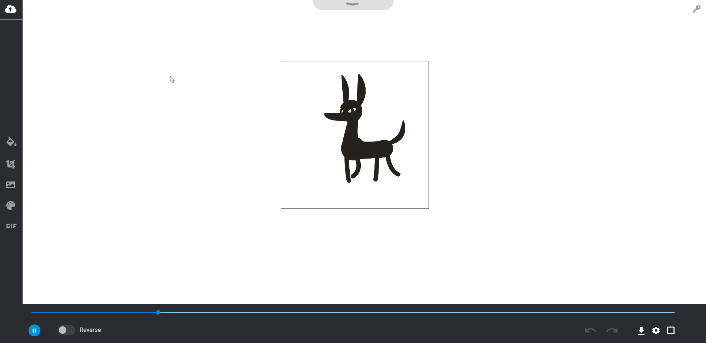

[Back to contents](#contents)
 

## 2. Play & Pause
- Play & Pause : `Space`
 

[Back to contents](#contents)
 

## 3. Reverse
 - Reverse : `Ctrl + R`
 

[Back to contents](#contents)
 

## 4. Canvas
1. Border : `Ctrl + B `

 

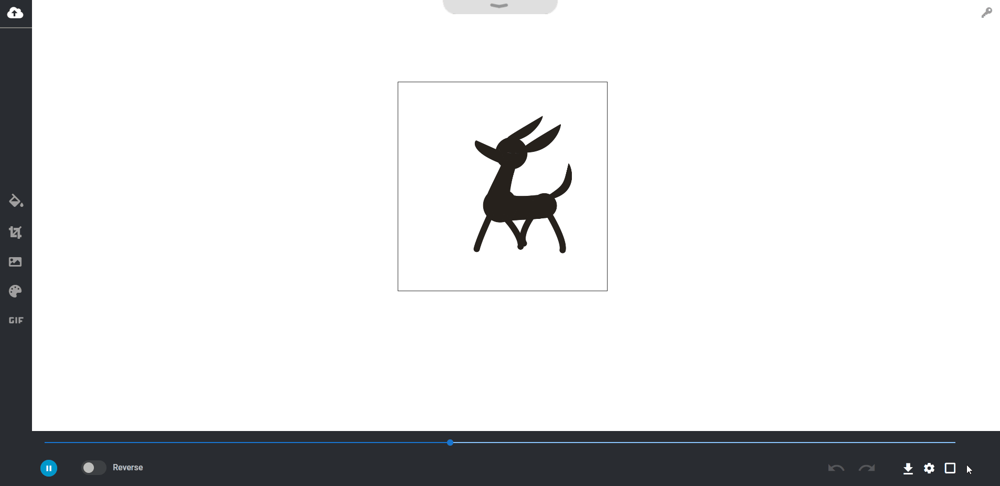

[Back to contents](#contents)
 

2. Size : Text feild or Drag
 

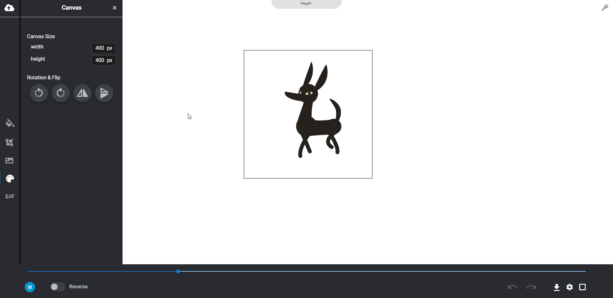

[Back to contents](#contents)
 

3. Flip & Rotation
 

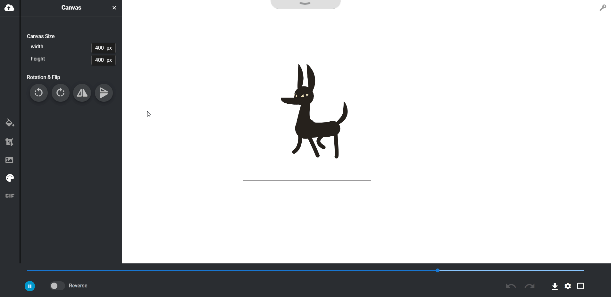

[Back to contents](#contents)
 

4. Drag & Drop
 

[Back to contents](#contents)
 

## 5. Speed

 

[Back to contents](#contents)
 

## 6. Play bar

 

[Back to contents](#contents)
 

## 7. Keypath & Highlighting
 

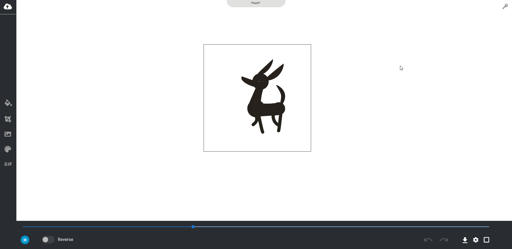

[Back to contents](#contents)
 

## 8. Change Fill & Stroke

 

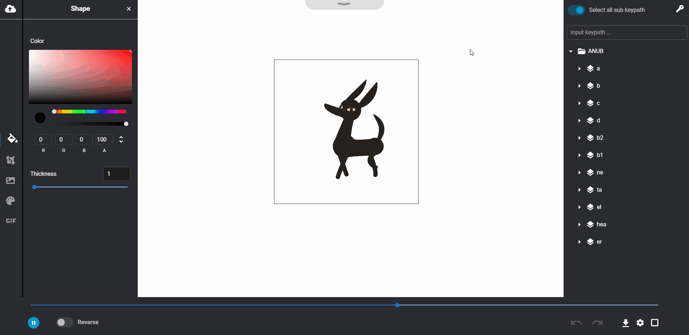

[Back to contents](#contents)
 

## 9. Change Transform

 

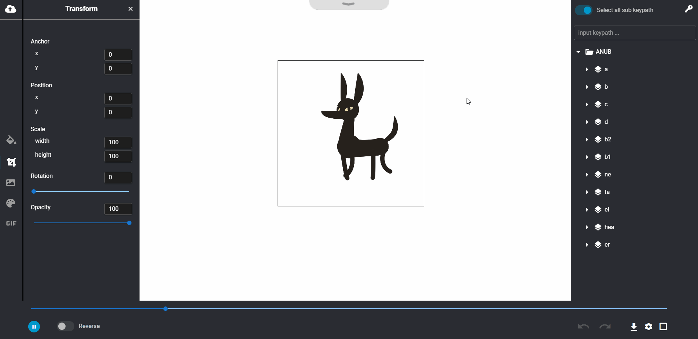

[Back to contents](#contents)
 

## 10. Task management / Redo & Undo
- Undo : `Ctrl + Z`
- Redo : `Ctrl + Shift + Z`
 

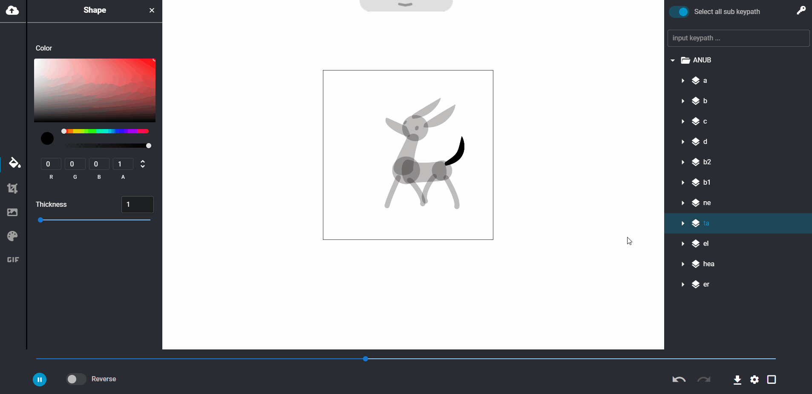

[Back to contents](#contents)
 

## 11. Mockup

 

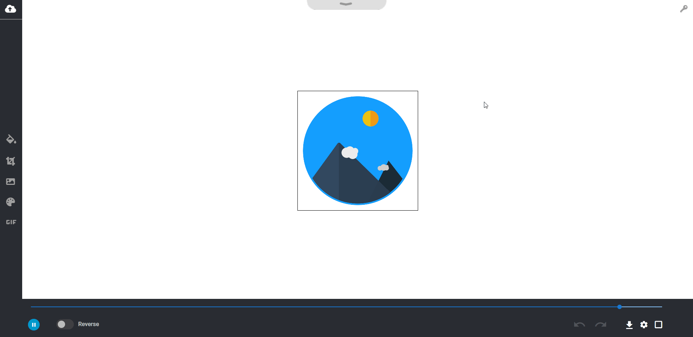

[Back to contents](#contents)
 

## 12. Background

 

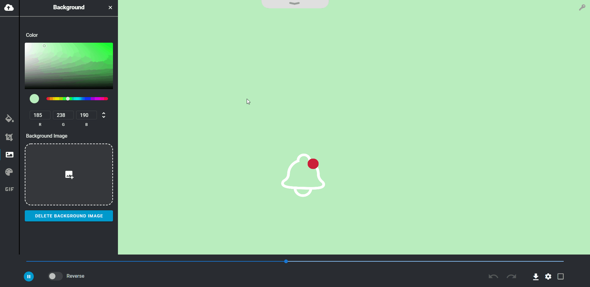

[Back to contents](#contents)
 

## 13. Download gif

 

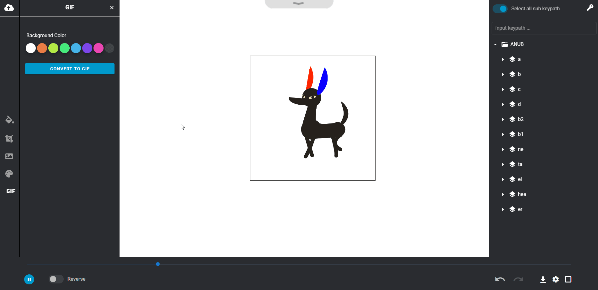

[Back to contents](#contents)
 
