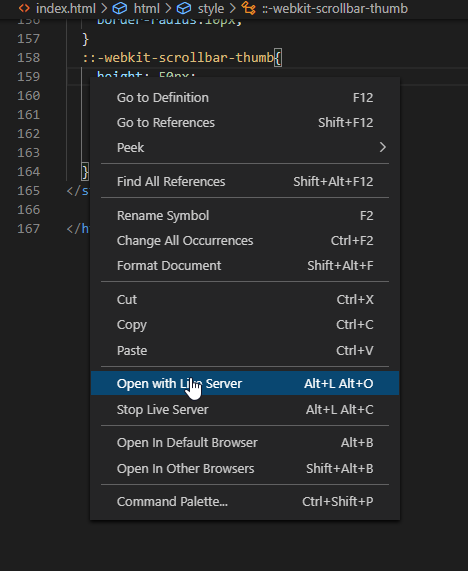

# [Prettie](http://rlottie.com/)

[](https://gitter.im/rLottie-dev/community?utm_source=badge&utm_medium=badge&utm_campaign=pr-badge)

<p align="center">
  
</p>

Prettie is a platform that supports web preview by rendering vector based animations and art in realtime.

We aimed to communicate more efficiently between designers and developers.

If you watch the beautiful animation provieded by Prettie, you can reduce boredom and communicate comfortably.

Here is sample of the power of Prettie.

<p align="center">
  
</p>

<br>

<br>

# What can I do with it?

- **Key-path management—** The key-paths of the layer and asset used in the lottile file are provided as a tree view. This is the easiest way to manage many key-paths.

- **Highlighting—** Highlighting effect is provided to a componenet selected through the key-path.

- **Access and change the actual properties—** Users can access the properties of components in the actual file, change the value, and integrate it into a new json file.

- **Task management—** Users want to try various changes with preview and find animation in good changes. The edited task records are managed internally and Users can be moved freely to the desired point.

- **New tools for canvas and background—** An essential element for creating custom design tooling. In prettie, Users can customize background, position and size to create desired scene.

- **Mockup tool —** Users want to see lottie animation with product. Provides a preview with several mockups.

<br>

<br>

# Contents

- [Prettie](#prettie)
- [What can I do with it?](#what-can-i-do-with-it)
- [Contents](#contents)
- [Env Setup](#env-setup)
- [Build](#build)
- [Run](#run)
- [Documentation](#documentation)
- [Issues or Feature Requests?](#issues-or-feature-requests)

<br>

<br>

# Env Setup

- Setup the emscripten sdk environment
  Follow Down and Install steps https://emscripten.org/docs/getting_started/downloads.html
- Clone the repo using git clone --recurse-submodules https://github.com/rlottie/rlottie.github.io.git command

  - submodles are created at /rlottie. It is already built, if you don't need additional api, you don't need to build the submodule.

- Install [Visual Studio Code](https://code.visualstudio.com/) on Windows 10

- Install [Live Server](https://marketplace.visualstudio.com/items?itemName=ritwickdey.LiveServer) on [Visual Studio Code](https://code.visualstudio.com/)

<br>

<br>

# Build

```bash
  cd rlottie
  ./wasm_build.sh {emscripten_sdk_path}  #ex: /your_path/emsdk/
  cp builddir_wasm/src/rlottie-wasm.* ../
```

- NOTE : to get a callstack modify build.sh file by passing the build flag -s assertions=1

<br>

<br>

# Run

1. Right click on the `index.html` file
2. Click 'Open with Live Server'
<p>
  
</p>

[Back to contents](#contents)
<br>

<br>

# Documentation

- [Manual](./.Gifs/README.md)

[Back to contents](#contents)
<br>

<br>

# Issues or Feature Requests?

- If you find a problem with functions of Prettie, Be sure to check the `issues` tab. If it is not working properly, please submit an issue and attach the After Effects file with a brief description. Debugging without the original can be very difficult. For immidiate assistant or support please reach us in [Gtter](https://gitter.im/rLottie-dev/community?utm_source=badge&utm_medium=badge&utm_campaign=pr-badge)
