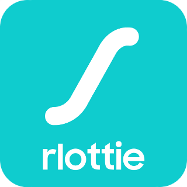

<center></center>

## Introduction
Prettyview is the most convenient lottie web player.

- **Simple Customization**: In the left panel(called the Layer Panel), the layers are shown in a tree structure, and users can access each layer by clicking on it or searching the keypath. If one of the layers are clicked, the Property Panel will be activated on the right side. In the Property Panel, you can easily adjust properties such as color, opacity, and position, and find out the immediate changes. In addition, various options are provided to allow users to freely adjust the playback settings.

    좌측 패널에서 사용자들에게 layer를 Tree구조로 보여주고, layer별로 접근하는 것이 가능합니다. 만약 layer를 클릭한다면, 우측에 property 패널이 나타납니다. 우측의 property 패널을 통해, color, opacity, and position 등의 property를 손쉽게 조정하고, 변경된 부분을 바로 확인할 수 있습니다. 이와 더불어 유저가 재생 환경을 자유롭게 조정할 수 있게끔 다양한 옵션을 제공하고 있습니다.

- **Various View Frames**: PrettyView provides a function called Multi View that allows you to customize four canvases and compare them at the same time, and a view frame changing option that allows you to check how your animation files will look in different environments.

    같은 애니메이션이어도, 다르게 property를 적용하고, 동시에 비교해볼 수 있는 멀티뷰 기능과 각각의 상황에서 어떻게 보일지 확인할 수 있는 View Frame을 제공합니다.

- **User-centered Design**: PrettyView keeps track of previously applied information values for each layer, so that users can check them right away. For UI/UX design, PrettyView provides Light/Dark modes and various shortcuts to make it faster and more convenient to use.

    각 layer에 기존에 적용시켰던 정보값들을 기록하여 사용자들이 바로바로 확인할 수 있도록 하였습니다. light/dark mode 통해 편안한 환경을 제공하였습니다. 그리고 다양한 단축키들을 통해 더 빠르고 쉽게 사용할 수 있게 하였습니다.

<br>

## Features
- [x] Change layer color
- [x] Change layer opacity
- [x] Change layer position
- [x] Keypath search
- [x] Multi view
- [x] Play speed, type, direction
- [x] Change layer opacity
- [x] Canvas shape, rotation
- [ ] Transforms
- [ ] Mask Opacity
- [ ] Gradient

<br>

## Getting Started
### Env Setup

- Setup the emscripten sdk environment. Follow  DoDown and Install steps [emscripten](https://emscripten.org/docs/getting_started/downloads.html)
- Clone the repo
```bash
$ git clone --recurse-submodules https://github.com/rlottie/rlottie.github.io.git
```

### Build
```bash
$ cd rlottie
$ ./wasm_build.sh {absolute_emsdk_folder_path}
$ cp builddir_wasm/src/rlottie-wasm.* ../
```
- NOTE : to get a callstack modify build.sh file by passing the build flag -s assertions=1


### test
```bash
$ run ./test.sh
```

<br>

## How to Use

[video](https://youtu.be/Fz7KcsjXHv8)

<br>

## License

No License

**But [gif.js](https://github.com/jnordberg/gif.js) has MIT License**
